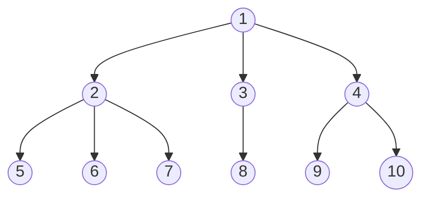

Naturally, we aim to gain insights into the prediction process and identify relevant features, which fall under the umbrella of *interpretability*. Following, ([[@liptonMythosModelInterpretability2017]]4) interpretability can be reached through model transparency or post-hoc interpretability methods. Transparent models provide interpretability through a transparent mechanism in the model, whereas post-hoc interpretability refers to approaches that extract information from the already learnt model ([[@liptonMythosModelInterpretability2017]] 4--5). 

Classical trade classification algorithms, as a rule-based approach, are transparent with an easily understandable decision process, and thus provide interpretability ([[@barredoarrietaExplainableArtificialIntelligence2020]]91). Interpretability, however decreases for deep stacked combinations involving a large feature count, such as the gls-GSU method, interactions between base rules become more complex, and the effect of single feature on the final prediction more challenging to interpret.-footnote Consider the deep stacked combination from cref ... both the ordering plays a role for ...

The machine learning classifiers, studied in this work, can be deemed a black box model ([[@barredoarrietaExplainableArtificialIntelligence2020]]90). Due to the sheer size of the network or ensemble, interpretability through transparency is impacted. Albeit, the attention mechanism of Transformers provides some interpretability through transparency (see discussion on attention maps), interpretability across all classifiers can only be reached through *model-agnostic, post-hoc interpretability techniques*.

Estimating feature importances is non-trivial in our work. Features are dependent due to the data generating process with strongly correlated quote and trade prices at the exchange and nation-wide level. The redundant feature encoding (cp. [[🪄Feature Engineering]]) exacerbates this effect. Feature independence, however, is the central assumption of most popular feature importance measures, including gls-SHAP, gls-LIME, or gls-rfpm ([[@aasExplainingIndividualPredictions2021]]2). <mark style="background: #ABF7F7A6;">A violation of this assumption can lead to substitution effects, see ([[@lopezdepradoAdvancesFinancialMachine2018]]) for a detailed discussion in the context of finance. Alternatively see ([[@covertUnderstandingGlobalFeature2020]]4) A violation of this assumption can lead to wrong feature importances with the feature importance of dependent features distributed among dependent features.</mark>

For this reason we estimate feature importances using gls-SAGE, which can account for complex interactions between features and gives the contribution of a feature to the performance of the classifier. gls-SAGE is a global feature importance measure based on 

Thereby, our goal is to understand the contribution of features to the model on a dataset, hence global level.

Solving for (...) is practically intractable.

Thereby, our goal is learn how much features contribute to the performance of the classifier on a dataset level. This is fundamentally different from methods like standard gls-SHAP, that attribute *any* prediction to the input features ([[@chenTrueModelTrue2020]]??).

Recall from cref-[[🪄Feature Engineering]] that features may be encode 
The redundant encoding can make patterns in the data learnable but complicates attributing predictions to certain features due to substitution effects. We address this concern when determining the feature's importances.

Many model-agnostic methods are based on the randomly permuting features values. In this work, we specifically consider the variants *permutation feature importance* ([[@breimanRandomForests2001]]23--24) and partial-dependence plots ([[@friedmanGreedyFunctionApproximation2001]]26--28). Both serve a complementary purpose. Permutation feature importance derives the feature importance from the change in predictive accuracy before and after permuting a feature randomly, whereas partial dependence plots visualise the average change in prediction, if feature values are altered. These are widely adopted and computationally efficient.

The redundant encoding of features in cref-[[🪄Feature Engineering]] makes patterns in the data learnable but complicates attributing predictions to certain features due to substitution effects. We address this concern when determining the feature's importances.

For consistency to cref-[[🧭Evaluation metric]] we use the zero-one loss as a loss function and importances are estimated on the test set. 

### Permutation feature importance

Permutation feature importance derives the importance from the mean decrease in accuracy before and after permuting a feature randomly. Expectedly, permuting features breaks the association with the target. Thus, the permutation of important features leads to a sharp decrease in accuracy, whereas unimportant features leave the accuracy unaffected. 
The importance measure was originally proposed ([[@breimanRandomForests2001]]23--24) for random forests, and has later been extended by ([[@fisherAllModelsAre]]??) into a model-agnostic feature importance measure. 

Given our feature matrix $\mathbf{X}$, we can define a second permuted version, $\mathbf{X}^{\pi,j}$, where the $j$-th feature is randomly permuted by $\pi$. Using $L(y_i, h(\mathbf{x}_i))$ for predicting $y_i$ from $h(\mathbf{x}_{i})$, the importance of $j$-th feature is given by:
$$
\operatorname{VI}^{\pi}_{j} = \sum_{i=1}^{N} L(y_{i}, h(\mathbf{x}_{i}^{\pi,j})) - L(y_{i}, h(\mathbf{x}_{i})),
$$
which is the increase in loss, i.e., accuracy, before and after permutation ([[@hookerUnrestrictedPermutationForces2021]]82). While ([[@breimanRandomForests2001]]23--24) uses a single permutation, ([[@fisherAllModelsAre]]??) consider multiple, random permutations. By definition, random feature importance only yields global feature importances, as the measure is aggregated from all $N$ samples.

### Extending permutation feature importance ✅
Random feature permutation has the desirable properties of being easy to interpret, computationally efficient and model-agnostic. Like other feature importance measures, including SHAP or LIME, it assumes independence between features ([[@aasExplainingIndividualPredictions2021]]2). 

As defined in cref-eq-random-feature-permutation, every feature is permuted independently from other features which artificially breaks correlations between features and creates unrealistic feature combinations. Consider, for example, the apparent correlation between the ask, bid price and trade price. Permuting only the ask, could result in strongly negative or extremely large spreads, whereas bid and trade price remain unchanged. In effect, the presence of correlated features, leads to an overestimate of the importance of correlated features ([[@stroblConditionalVariableImportance2008]]3). 

Vice versa, can the presence of a correlated features decrease the importance of the associated feature, as the feature importance now distributed across the features, thereby underestimating the true importance of the features. This effects all features, where information is encoded redundantly, such as the bid-ask ratio. (footnote-for an extended discussion of substitution effects on feature importance in the financial domain see ([[@lopezdepradoAdvancesFinancialMachine2018]]114--118).

To alleviate the bias from correlated / depenedent, we group dependent features and estimate the feature importance on the group-level. Arranging all features in a tree-like hierarchy gives us the freedom to derive feature importances at different levels, enabling cross-comparisons between classical rules and machine learning based classifiers, as grouping of raw and derived features makes the implementation of classical rules transparent. (footnote: Consider the implementation of the tick rule. Here, the implementation could use the feature price lag (ex) or calculate the price change from the trade price and price lag (ex). If not grouped, feature importances would be attributed to either the derived feature or raw features causing difficulties in comparison with machine learning classifiers, which have access to all three features simultaneously. Grouping all three features resolves this issue at the cost of interpretability.). Other than the classical permutation importance from cref-eq-random-feature-permutation, all features sharing the same parent node are permuted together. We define the following dependency structure:

Groupings are created to be mutually exclusive and based on the dependency structure of classical trade classification algorithms. The computational demand is comparable to classical feature permutation, as grouping results in fewer permutations, but the analysis may be repeated on several sub-levels. 

To this end, we want to emphasise, that our approach is different from ([[@ronenMachineLearningTrade2022]]52) as we do not estimate the improvement from adding new features, but keep the feature sets fixed-sized and permute them.

### Partial dependence plots
Related to the concept of random feature permutation are partial dependence plots by ([[@friedmanGreedyFunctionApproximation2001]] 26--28) visualise the dependency between a single (or multiple) feature and the effect on the traget value as the feature value is adjusted / after marginalising out all other features. Let $\mathbf{X}^{x,j}$ be a matrix, where the $j$-th feature value is replaced by $x$ and all other features are unaltered, partial feature dependence function:
$$
\operatorname{PD}_{j}(x) = \frac{1}{N} \sum_{i=1}^{N} f(\mathbf{x}^{x,j}_{i}),
$$
now gives the marginal average over all other features ([[@hookerUnrestrictedPermutationForces2021]]81). By iterating over a grid of (observed) $x$, we obtain the partial dependence plot for the feature.

Like random feature permutation, partial dependence plots are a global feature importance measure, unable to capture dependencies between features and visualisation is constrained to two dimensions or features at once ([[@hastietrevorElementsStatisticalLearning2009]] p. 388). Despite these limitation, partial dependence plots to help us verify the assumed relationships in classical rules, such as the the linear relationship in the tick rule, with the learnt relationships in our classifier.

Following a common track in literature, we report feature importance estimates on the test data. 
