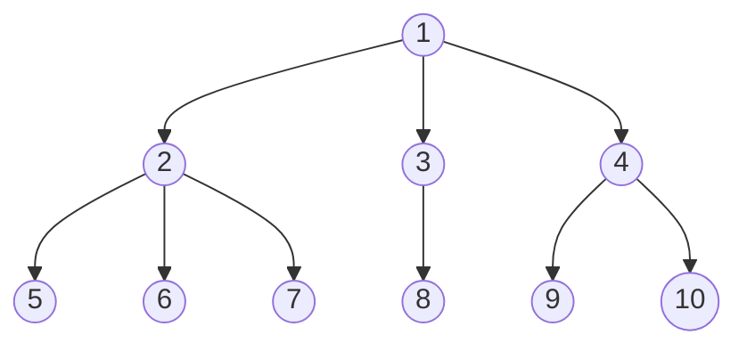

Naturally, one would like to obtain insights into how the models arrived at the prediction and identify features relevant for the prediction. Both aspects can be subsumed under the term *interpretability*. Following, ([[@liptonMythosModelInterpretability2017]]4) interpretability can be reached through model transparency or post-hoc interpretability methods. Transparent models provide interpretability through a transparent mechanism in the model, whereas post-hoc interpretability refers to approaches that extract information from the already learned model ([[@liptonMythosModelInterpretability2017]] 4--5). 

Classical trade classification algorithms, as a rule-based approach, are transparent with an easily understandable decision process, and thus provide interpretability ([[@barredoarrietaExplainableArtificialIntelligence2020]]91). Interpretability, however decreases for deep stacked combinations involving a large feature count, such as the gls-GSU method, interactions between base rules become more complex, and the effect of single feature on the final prediction more challenging to interpret. 

The machine-learning classifiers, studied in this work, can be deemed a black box model ([[@barredoarrietaExplainableArtificialIntelligence2020]]90). Due to the sheer size of the network or ensemble, interpretability through transparency is impacted. Albeit, the attention mechanism of Transformers provides some interpretability through transparency (see discussion on attention maps),  interpretability across all classifiers can only be reached through a *model-agnostic, post-hoc interpretability techniques*. Thereby, our goal is to identify features that are important for the *correct prediction*. This is fundamentally different from methods like standard gls-SHAP, that attribute *any* prediction to the input features ([[@chenTrueModelTrue2020]]??).

Many model-agnostic methods are based on the randomly permuting features values. In this work, we specifically consider the variants *permutation feature importance* ([[@breimanRandomForests2001]]23--24) and partial-dependence plots ([[@friedmanGreedyFunctionApproximation2001]]26--28). Both serve a complementary purpose. Permutation feature importance derives the feature importance from the change in predictive accuracy before and after permuting a feature randomly, whereas partial dependence plots visualize the average change in prediction, if feature values are altered. These are widely adopted and computationally efficient.

### Permutation feature importance

Permutation feature importance derives the importance from the change in the p
Permutation feature importance was originally proposed ([[@breimanRandomForests2001]]23--24) in the context of random forests, and later been extended by ([[@fisherAllModelsAre]]) into a model-agnostic feature importance measure. Other than 

By definition, random feature importance only yields global feature importances, as the change in accuracy is averaged from all samples.

> 📑The permutation accuracy importance, that is described in more detail in Section 3, follows the rationale that a random permutation of the values of the predictor variable is supposed to mimic the absence of the variable from the model. The difference in the prediction accuracy before and after permuting the predictor variable, i.e. with and without the help of this predictor variable, is used as an importance measure. (https://epub.ub.uni-muenchen.de/2821/1/deck.pdf)

> 📑The concept is really straightforward: We measure the importance of a feature by calculating the increase in the model's prediction error after permuting the feature. A feature is "important" if shuffling its values increases the model error, because in this case the model relied on the feature for the prediction. A feature is "unimportant" if shuffling its values leaves the model error unchanged, because in this case the model ignored the feature for the prediction. The permutation feature importance measurement was introduced by Breiman $(2001)^{43}$ for random forests. Based on this idea, Fisher, Rudin, and Dominici $(2018)^{44}$ [[@fisherAllModelsAre]] proposed a model-agnostic version of the feature importance and called it model reliance. They also introduced more advanced ideas about feature importance, for example a (model-specific) version that takes into account that many prediction models may predict the data well. Their paper is worth reading. (Molnar)

> 📑RF can determine the importance of a feature to STLF by calculating the PI value of each feature. When calculating the importance value of feature $F^j$ based on the $i$ th tree, OOBError $r_i$ is first calculated based on Equation (3). Then, the values of feature $F^j$ in the $\mathrm{OOB}$ dataset are randomly rearranged and those of the other features are unchanged, thereby forming a new $O O B$ dataset $O O B_i^{\prime}$. With the new $O O B_i{ }^{\prime}$ set, $O O B$ Error $_i{ }^{\prime}$ can also be calculated using Equation (3). The PI value of feature $F^j$ based on the $i$ th tree can be obtained by subtracting $O O B$ Error $_i$ from $O O B E r r r_i^{\prime}$.
$$
P I_i\left(F^j\right)=O O B E r r o r_i^{\prime}-O O B E r r o r_i
$$
The calculation process is repeated for each tree. The final PI value of feature $F i$ can be obtained by averaging the PI values of each tree:
$$
P I\left(F^j\right)=\frac{1}{c} \sum_{i=1}^c P I_i\left(F^j\right),
$$

> 📑Again, our definition of empirical MR is very similar to the permutation-based variable importance approach of Breimar (2001), where Breimar uses a single random permutation and we consider all possible pairs. To compare these two approaches more precisely, let $\left\{\pi_1, \ldots, \pi_{n !}\right\}$ be a set of $n$-length vectors, each containing a different permutation of the set $\{1, \ldots, n\}$. The approach of Breimar. (2001) is analogous to computing the loss $\sum_{i=1}^n L\left\{f,\left(\mathbf{y}_{[i]}, \mathbf{X}_{1\left[\pi_{[[i]},\right]}, \mathbf{X}_{2[i,]]}\right)\right\}$ for a randomly chosen permutation vector $\pi_l \in\left\{\pi_1, \ldots, \pi_{n !}\right\}$. Similarly, our calculation in Eq 3.i. is proportional to the sum of losses over all possible ( $n$ !) permutations, excluding the $n$ unique combinations of the rows of $\mathbf{X}_1$ and the rows of $\left[\begin{array}{ll}\mathbf{X}_2 & \mathbf{y}\end{array}\right]$ that appear in the original sample (see Appendix A.i.). Excluding these observations is necessary to preserve the (finite-sample) unbiasedness of $\hat{e}_{\text {switch }}(f)$

> 📑The rationale of the original random forest permutation importance is the following: By randomly permuting the predictor variable $X_j$, its original association with the response $Y$ is broken. When the permuted variable $X_j$, together with the remaining non-permuted predictor variables, is used to predict the response for the out-of-bag observations, the prediction accuracy (i.e. the number of observations classified correctly) decreases substantially if the original variable $X_j$ was associated with the response. Thus, Breiman (2001a) suggests the difference in prediction accuracy before and after permuting $X_j$, averaged over all trees, as a measure for variable importance, that we formalize as follows: Let $\overline{\mathfrak{B}}^{(t)}$ be the out-of-bag (oob) sample for a tree $t$, with $t \in\{1, \ldots, n t r e e\}$. Then the variable importance of variable $X_j$ in tree $t$ is (https://epub.ub.uni-muenchen.de/2821/1/deck.pdf)
$$
V I^{(t)}\left(\mathbf{X}_j\right)=\frac{\sum_{i \in \overline{\mathfrak{B}}^{(t)}} I\left(y_i=\hat{y}_i^{(t)}\right)}{\left|\overline{\mathfrak{B}}^{(t)}\right|}-\frac{\sum_{i \in \overline{\mathfrak{B}}^{(t)}} I\left(y_i=\hat{y}_{i, \pi_j}^{(t)}\right)}{\left|\overline{\mathfrak{B}}^{(t)}\right|}
$$
> 📑The rationale of the original random forest permutation importance is the following: By randomly permuting the predictor variable $X_j$, its original association with the response $Y$ is broken. When the permuted variable $X_{j^{\prime}} \quad$ where $\hat{\gamma}_i^{(t)}=f^{(t)}\left(\mathrm{x}_i\right)$ is the predicted class for observation together with the remaining non-permuted predictor var- $\quad i$ before and $\hat{y}_{i, \pi_j}^{(t)}=f^{(t)}\left(\mathrm{x}_{i, \pi_j}\right)$ is the predicted class for iables, is used to predict the response for the out-of-bag observations, the prediction accuracy (i.e. the number of observations classified correctly) decreases substantially if with $\mathrm{x}_{i, \pi_j}=\left(x_{i, 1}, \ldots, x_{i, j-1,1} x_{\pi_j(i), j}, x_{i, j+1}, \ldots, x_{i, p}\right)$. (Note that the original variable $X_j$ was associated with the response. $V I(t)\left(\mathbf{X}_j\right)=0$ by definition, if variable $X_j$ is not in tree $t$.) The Thus, Breiman [1] suggests the difference in prediction raw variable importance score for each variable is then accuracy before and after permuting $X_j$, averaged over all computed as the mean importance over all trees: trees, as a measure for variable importance, that we formalize as follows: Let $\overline{\mathcal{B}}^{(t)}$ be the out-of-bag (oob) sam$V I\left(\mathrm{x}_j\right)=\frac{\sum_{t=1}^{n \text { tree } V I}(t)\left(\mathrm{x}_j\right)}{\text { ntree }}$ ple for a tree $t$, with $t \in\{1, \ldots$, ntree $\}$. Then the variable In standard implementations of random forests an addiimportance of variable $X_j$ in tree $t$ is tional scaled version of the permutation importance (often called $z$-score), that is achieved by dividing the raw importance by its standard error, is provided. However,) (Conditional variable importance for random forests Carolin Strobl*1, Anne-Laure Boulesteix2, Thomas Kneib1, Thomas Augustin1 and Achim Zeileis3)

> 📑We consider ML prediction functions ˆf : Rp 7→ R, where ˆf(x) is a model prediction and x ∈ Rp is a p-dimensional feature vector. We use xj ∈ Rn to refer to an observed feature (vector) and Xj to refer to the j-th feature as a random variable. With x−j we refer to the complementary feature space x{1,...,p}\{j} ∈ Rn×(p−1) and with X−j to the corresponding random variables. We refer to the value of the j-th feature from the i-th instance as x (i) j and to the tuples D = { x (i) , y(i)  } n i=1 as data. The Permutation Feature Importance (PFI) is defined as the increase in loss when feature Xj is permuted: P F Ij = E[L(Y, ˆf(X˜ j , X−j ))] − E[L(Y, ˆf(Xj , X−j ))] (1) If the random variable X˜ j has the same marginal distribution as Xj (e.g., permutation), the estimate yields the marginal PFI. If X˜ j follows the conditional distribution X˜ j ∼ Xj |X−j , we speak of the conditional PFI. The PFI is estimated with the following formula: P F I j = 1 n Xn i=1 1 M X M m=1 L˜m(i) − L (i) ) ! (2 Importance and Effects with Dependent Features 5 where L (i) = L(y (i) , ˆf(x (i) )) is the loss for the i-th observation and L˜(i) = L(y (i) , ˆf(˜x (i) j , x (i) −j )) is the loss where x (i) j was replaced by the m-th sample x˜ m(i) j . The latter refers to the i-th feature value obtained by a sample of xj . The sample can be repeated M-times for a more stable estimation of L˜(i) . Numerous variations of this formulation exist. Breiman (2001) proposed the PFI for random forests, which is computed from the out-of-bag samples of individual trees. Subsequently, Fisher et al. (2019) introduced a model-agnostic PFI version. ((https://arxiv.org/pdf/2006.04628.pdf)) 

> 📑“Following simplification procedures, feature relevance techniques are also used in the field of tree ensembles. Breiman [286] was the first to analyze the variable importance within Random Forests. His method is based on measuring MDA (Mean Decrease Accuracy) or MIE (Mean Increase Error) of the forest when a certain variable is randomly permuted in the out-of-bag samples. Following this contribution [241] shows, in an real setting, how the usage of variable importance reflects the underlying relationships of a complex system modeled by a Random Forest” ([[@barredoarrietaExplainableArtificialIntelligence2020]]., 2020, p. 94)

### Extending permutation feature importance ✅
Random feature permutation has the desirable properties of being easy to interpret, computationally efficient and model-agnostic. Like other feature importance measures, including SHAP or LIME, it assumes independence between features ([[@aasExplainingIndividualPredictions2021]]2). 

As defined in cref-eq-random-feature-permutation, every feature is permuted independently from other features which artificially breaks correlations between features and creates unrealistic feature combinations. Consider, for example, the apparent correlation between the ask, bid price and trade price. Permuting only the ask, could result in strongly negative or extremely large spreads, whereas bid and trade price remain unchanged. In effect, the presence of correlated features, leads to an overestimate of the importance of correlated features ([[@stroblConditionalVariableImportance2008]]3). 

Vice versa, can the presence of a correlated features decrease the importance of the associated feature, as the feature importance now distributed across the features, thereby underestimating the true importance of the features. This effects all features, where information is encoded redundantly, such as the bid-ask ratio. (footnote-for an extended discussion of substitution effects on feature importance in the financial domain see ([[@lopezdepradoAdvancesFinancialMachine2018]]114--118).

To alleviate the bias from correlated / depenedent, we group dependent features and estimate the feature importance on the group-level. Arranging all features in a tree-like hierarchy gives us the freedom to derive feature importances at different levels, enabling cross-comparisons between classical rules and machine learning based classifiers, as grouping of raw and derived features makes the implementation of classical rules transparent. (footnote: Consider the implementation of the tick rule. Here, the implementation could use the feature price lag (ex) or calculate the price change from the trade price and price lag (ex). If not grouped, feature importances would be attributed to either the derived feature or raw features causing difficulties in comparison with machine learning classifiers, which have access to all three features simultaneously. Grouping all three features resolves this issue at the cost of interpretability.). Other than the classical permutation importance from cref-eq-random-feature-permutation, all features sharing the same parent node are permuted together. We define the following dependency structure:

Groupings are created to be mutually exclusive and based on the dependency structure of classical trade classification algorithms. The computational demand is comparable to classical feature permutation, as grouping results in fewer permutations, but the analysis may be repeated on several sub-levels. 

Following ([[@breimanRandomForests2001]]23--24) we report our so-created results in cref-[[🏅Results]] on test data. 

To this end, we want to emphasize, that our approach is different from ([[@ronenMachineLearningTrade2022]]52) as we do not estimate the improvement from adding new features, but keep the feature sets fixed-sized and permute them.

### Partial dependence plots
Related to the concept of random feature permutation are partial dependence plots by ([[@friedmanGreedyFunctionApproximation2001]] 26--28). These visualize the dependency between a single (or multiple) feature and the predicted target as the feature value is adjusted. 

Following ([[@hookerUnrestrictedPermutationForces2021]]81), we newly define a feature matrix $\mathbf{X}^{x,j}$ from the feature matrix $\mathbf{X}$, where the value of the $j$-th feature is replaced by the value $x$. The partial dependence function for the $j$-th feature is now given by:
$$
\operatorname{PD}_{j}(x) = \frac{1}{N} \sum_{i=1}^{N} f(\mathbf{x}^{x,j}_{i}).
$$
$PD_{j}(x)$ now gi . Repeating 

Like random feature permutation, partial dependence plots are a global feature importance measure, unable to capture dependencies between features. Naturally, visualization is constrained to two dimensions or features at once. Despite these limitation, partial dependence plots to help us verify the assumed relationships in classical rules, such as the the linear relationship in the tick rule, with the learned relationships in our classifier.

> 📑The marginal Partial Dependence Plot (PDP) (Friedman et al., 2001) describes the average effect of the j-th feature on the prediction. P DPj (x) = E[ ˆf(x, X−j )], (3) If the expectation is conditional on Xj , E[ ˆf(x, X−j )|Xj = x], we speak of the conditional PDP. The marginal PDP evaluated at feature value x is estimated using Monte Carlo integration: P DP \j (x) = 1 n Xn i=1 ˆf(x, x (i) −j ) (4)  (https://arxiv.org/pdf/2006.04628.pdf) 

> 📑 Partial Dependence Plots (PDPs) Friedman (2001) suggested examining the effect of feature j by plotting the average prediction as the feature is changed. Specifically, letting Xx,j be the matrix of feature values where the jth entry of every row has been replaced with value x, we define the partial dependence function PDj(x) = 1 N N i=1 f (xx,j i ) as the average prediction made with the jth feature replaced with the value x. Since these are univariate functions (multivariate versions can be defined naturally), they can be readily displayed and interpreted. ([[@hookerUnrestrictedPermutationForces2021]])

> 📑Partial dependence works by marginalizing the machine learning model output over the distribution of the features in set C, so that the function shows the relationship between the features in set S we are interested in and the predicted outcome. By marginalizing over the other features, we get a function that depends only on features in S, interactions with other features included. (Molnar)

> 📑The partial function ^fS�^� is estimated by calculating averages in the training data, also known as Monte Carlo method:
For classification where the machine learning model outputs probabilities, the partial dependence plot displays the probability for a certain class given different values for feature(s) in S. An easy way to deal with multiple classes is to draw one line or plot per class. (Molnar)

> 📑 The partial dependence plot (short PDP or PD plot) shows the marginal effect one or two features have on the predicted outcome of a machine learning model (J. H. Friedman 2001[30](https://christophm.github.io/interpretable-ml-book/pdp.html#fn30)). A partial dependence plot can show whether the relationship between the target and a feature is linear, monotonic or more complex. For example, when applied to a linear regression model, partial dependence plots always show a linear relationship.

> 📑 “s, especially when f (x) is dominated by low-order interactions (10.40). Consider the subvector XS of ℓ < p of the input predictor variables XT = (X1, X2, . . . , Xp), indexed by S ⊂ {1, 2, . . . , p}. Let C be the complement set, with S ∪ C = {1, 2, . . . , p}. A general function f (X) will in principle depend on all of the input variables: f (X) = f (XS , XC). One way to define the average or partial dependence of f (X) on XS is fS (XS ) = EXC f (XS , XC). (10.47) This is a marginal average of f , and can serve as a useful description of the effect of the chosen subset on f (X) when, for example, the variables in XS do not have strong interactions with those in XC. Partial dependence functions can be used to interpret the results of any “black box” learning method. They can be estimated by ̄ fS (XS ) = 1 N N ∑ i=1 f (XS , xiC), (10.48) where {x1C, x2C, . . . , xNC} are the values of XC occurring in the training data. This requires a pass over the data for each set of joint values of XS for which ̄ fS (XS ) is to be evaluated. This can be computationally intensive, 1lattice in R” ([[@hastietrevorElementsStatisticalLearning2009]] p. 388)

“The partial dependence function (Friedman, 1991) of a model ˆ f describes the expected effect of a feature after marginalizing out the effects of all other features. Partial dependence of a feature set XS, S ⊆ {1, . . . , p} (usually |S| = 1) is defined as: P DS = EXC [ ˆ f (x, XC )], (1) where XC are the remaining features so that S ∪C = {1, . . . , p} and S ∩C = ∅. The PD is estimated using Monte Carlo integration: ̂ P DS(x) = 1 n2 n2 ∑ i=1 ˆ f (x, x(i) C ) (2) For simplicity, we write P D instead of P DS, and ̂ P D instead of ̂ P DS when we refer to an arbitrary PD. The PD plot consists of a line connecting the points {(x(g), ̂ P DS(x(g))}gG=1, with G grid points that are usually equidistant or quantiles of PXS . See Figure 6 for an example of a PD plot.” ([[@molnarRelatingPartialDependence2021]], p. 5)