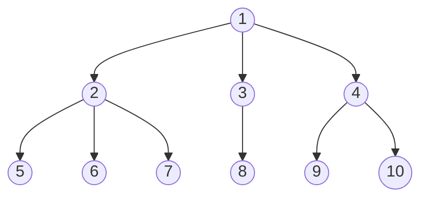

**Points to cover:**
- What is the goal? Interpretability? Explainability? Local? Global?
- What do we want to find out?
- Why does it make sense to use random feature permutation?
- Algorithmic description
- What are the problems of random feature permutation? Which ones are addressed? Which ones are not?
---

“The field of in-model interpretability [23] focuses on intrinsically interpretable models. These “transparent” [84]models naturally, and by design, provide some degree of interpretability. Lipton [84] classifies transparency in three dimensions, namely simulatability, decomposability, and algorithmic transparency. Simulatability relates to the ability to understand the entire model. Lipton [84]notesthat simulatability is not a direct consequence of the use of a particular model. For example, and even though models such as linear regression, rule-based systems, and decision trees are typically easier to interpret [8], in some cases, a compact neural network may be more transparent than the former alternatives. Note that even simple methods such as linear regression can become very challenging as the number of predictors increases. In expert systems based on if-then rules, it may not be possible to grasp all the rules and their interactions. Seemingly, decision trees can become too deep or too broad for graphical visualization and comprehension. Lipton [84]’s second notion of transparency, decomposability, defines to which degree the user can understand the model components − input data, parameters, and calculation rules. The third notion of Lipton [84]isalgorithmic transparency, which relates to the ability to understand the inferential process. It is important to consider these three notions when designing “transparent” machine learning models. We hereafter review some of the approaches proposed to achieve in-model transparency.” ([[@baptistaRelationPrognosticsPredictor2022]] p. 4) -> classical trade classification rules are interpretable / transparent

In addition to pre-model and in-model interpretability, there is post-model interpretability [23]. Post-model techniques analyze the model after its creation (post-hoc); they are devised as independent methods that can interpret the final decisions. There approaches can be model-specific or model-agnostic [8]. Post-hoc model-specific interpretability consists of methods specifically designed for a given machine learning algorithm. In contrast, post-hoc model-agnostic interpretability is agnostic to the analyzed machine learning model.

Classical trade classification algorithms, as a rule-based approach, are transparent and thus provide some degree of interpretability. (What is transparency? -> [[@liptonMythosModelInterpretability2017]]). However, for deep stacked stacked combinations involving a large feature count, such as the one of ([[@grauerOptionTradeClassification2022]] ), interactions between base rules become more complex, and the effect of single feature on the final prediction more challenging to interpret. 

“Rule based learners are great models in terms of interpretability across fields. Their natural and seamless relation to human behaviour makes them very suitable to understand and explain other models. If a certain threshold of coverage is acquired, a rule wrapper can be thought to contain enough information about a model to explain its behavior to a non-expert user, without forfeiting the possibility of using the generated rules as an standalone prediction model.” ([[@barredoarrietaExplainableArtificialIntelligence2020]] 2020, p. 91)

“Following simplification procedures, feature relevance techniques are also used in the field of tree ensembles. Breiman [286] was the first to analyze the variable importance within Random Forests. His method is based on measuring MDA (Mean Decrease Accuracy) or MIE (Mean Increase Error) of the forest when a certain variable is randomly permuted in the out-of-bag samples. Following this contribution [241] shows, in an real setting, how the usage of variable importance reflects the underlying relationships of a complex system modeled by a Random Forest” (Barredo Arrieta et al., 2020, p. 94)

“When ML models do not meet any of the criteria imposed to declare them transparent, a separate method must be devised and applied to the model to explain its decisions. This is the purpose of post-hoc explainability techniques (also referred to as post-modeling explainability), which aim at communicating understandable information about how an already developed model produces its predictions for any given input.” ([[@barredoarrietaExplainableArtificialIntelligence2020]] p. 92)

In a way, it boils down to the question of [audit versus insight](https://mindfulmodeler.substack.com/p/audit-or-insight-know-your-interpretation): SHAP importance is more about auditing how the model behaves. As in the simulated example, it’s useful to see how model predictions are affected by features X4, X6, and so on. For that SHAP importance is meaningful. But if your goal was to study the underlying data, then it’s completely misleading. Here PFI gives you a better idea of what’s really going on. Also, both importance plots work on different scales: SHAP may be interpreted on the scale of the prediction because SHAP importance is the average absolute change in prediction that was attributed to a feature. PFI is the average increase in loss when the feature information is destroyed (aka feature is permuted). Therefore PFI importance is on the scale of the loss.

The machine-learning classifiers, studied in this work can be deemed a black box model. Due to the sheer size of the network or ensemble, both classifiers are no longer transparent, necessitating post-hoc techniques for interpretability. We require a model-agnostic approach, which suffice for a cross-comparison between all classifiers. Our goal is to identify features that are important for the *correct prediction* in the model. This is fundamentally different from methods, such as LIME or SHAP, which attribute *any* prediction to the input features. 

As the 

One such 

This leaves us 

Consequently, we derive feature importances using random feature permutation, which is model-agnostic and computationally efficient.

Random feature permutation only yields global 

Our goal is to understand the contribution of a feature to the correct prediction, rather than attributing the prediction to specific features. 

Our setting is unique. 

As we defined derived features, such as the proximity to the quotes, features can not assumed to be independent. 

Substitution effects

However, feature independence is 

The features used by the model may also be different. The quote

Also machine learning classifiers have simultaneous access to 
Also feature importances, may be diluted over several features, known as as features may encode the same information redundantly

Also, features. Classical 

As such, we adapt random feature importance to our setting 

Random feature permutation was originally proposed in 

Random feature permutation is model-agnostic and can be used with different error estimates. For consistency the change in accuracy is used in our work.

The change can be estimated, as the absolute or relative difference.

Random feature permutation as proposed by b

Permuting features also

The complete algorithm is given in:

Two major drawbacks of random feature permutation, are 

One major drawback of random feature permutation is, that it doesn't help with local interpretability. Correlations are artificially broken

unrealistic permutations

We group dependent features and estimate the feature importance on a group-level. Arranging all features in a tree-like hierarchy gives us the freedom to derive feature importances at different levels, enabling cross-comparisons between classical rules and machine learning based classifiers, as grouping of raw and derived features makes the implementation of classical rules transparent. (footnote: Consider the implementation of the tick rule. Here, the implementation could use the feature price lag (ex) or calculate the price change from the trade price and price lag (ex). If not grouped, feature importances would be attributed to either the derived feature or raw features causing difficulties in comparison with machine learning classifiers, which have access to all three features simultaneously. Grouping all three features resolves this issue at the cost of interpretability.). Other than the classical permutation importance from cref-algorithm, all features sharing the same parent node are permuted together. We define the following dependency structure:

Groupings are created to be mutually exclusive and based on the dependency structure of classical trade classification algorithms. The computational demand is comparable to classical feature permutation, as grouping results in fewer permutations, but the analysis may be repeated on several sub-levels. Following ([[@breimanRandomForests2001]]) we report our so-created results in cref-[[🏅Results]] on test data. To this end, we want to emphasize, that our approach is different from ([[@ronenMachineLearningTrade2022]]52) as we do not estimate the improvement from adding new features, but keep the feature sets fixed-sized and permute them.

**Notes:**
[[🧭Random Feature Permutation notes]]

- 