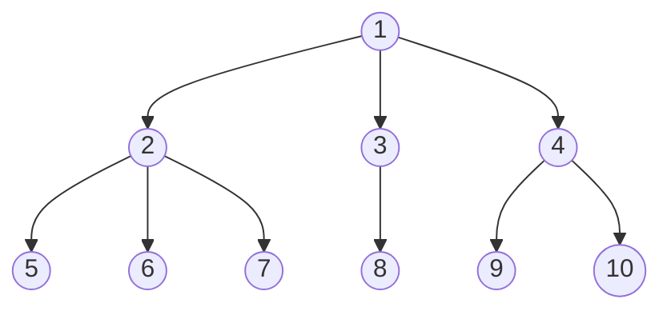

**Points to cover:**
- What is the goal? Interpretability? Explainability? Local? Global?
- What do we want to find out?
- Why does it make sense to use random feature permutation?
- Algorithmic description
- What are the problems of random feature permutation? Which ones are addressed? Which ones are not?
---

As the 

One such 

This leaves us 

Consequently, we derive feature importances using random feature permutation, which is model-agnostic and computationally efficient.

Random feature permutation only yields global 

Our goal is to understand the contribution of a feature to the correct prediction, rather than attributing the prediction to specific features. 

Our setting is unique. 

As we defined derived features, such as the proximity to the quotes, features can not assumed to be independent. 

Substitution effects

However, feature independence is 

The features used by the model may also be different. The quote

Also machine learning classifiers have simultaneous access to 
Also feature importances, may be diluted over several features, known as as features may encode the same information redundantly

Also, features. Classical 

As such, we adapt random feature importance to our setting 

Random feature permutation was originally proposed in 

Random feature permutation is model-agnostic and can be used with different error estimates. For consistency the change in accuracy is used in our work.

The change can be estimated, as the absolute or relative difference.

Random feature permutation as proposed by b

Permuting features also

The complete algorithm is given in:

Two major drawbacks of random feature permutation, are 

One major drawback of random feature permutation is, that it doesn't help with local interpretability. Correlations are artificially broken

unrealistic permutations

We group dependent features and estimate the feature importance on a group-level. Arranging all features in a tree-like hierarchy gives us the freedom to derive feature importances at different levels, enabling cross-comparisons between classical rules and machine learning based classifiers, as grouping of raw and derived features makes the implementation of classical rules transparent. (footnote: Consider the implementation of the tick rule. Here, the implementation could use the feature price lag (ex) or calculate the price change from the trade price and price lag (ex). If not grouped, feature importances would be attributed to either the derived feature or raw features causing difficulties in comparison with machine learning classifiers, which have access to all three features simultaneously. Grouping all three features resolves this issue at the cost of interpretability.). Other than the classical permutation importance from cref-algorithm, all features sharing the same parent node are permuted together. We define the following dependency structure:

Groupings are created to be mutually exclusive and based on the dependency structure of classical trade classification algorithms. The computational demand is comparable to classical feature permutation, as grouping results in fewer permutations, but the analysis may be repeated on several sub-levels. Following ([[@breimanRandomForests2001]]) we report our so-created results in cref-[[🏅Results]] on test data. To this end, we want to emphasize, that our approach is different from ([[@ronenMachineLearningTrade2022]]52) as we do not estimate the improvement from adding new features, but keep the feature sets fixed-sized and permute them.

**Notes:**
[[🧭Random Feature Permutation notes]]

- 