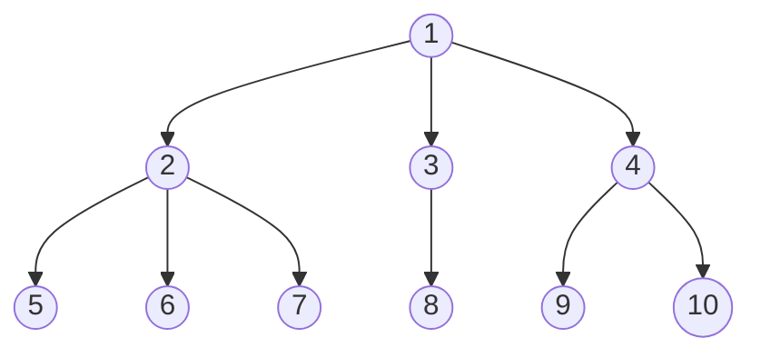

## Feature Engineering
Our largest feature set als contains dates and times of the trade. In contrast to other continuous features, the features are inherently cyclic. We exploit this property for hours, days, and months and apply a fourier transform to convert the features into a smooth variable using formula [[#^773161]]:

$$
\begin{aligned}
x_{\sin} &= \sin\left(\frac{2\pi x}{\max(x)} \right), \text{and}\\
c_{\cos} &= \cos\left(\frac{2\pi x}{\max(x)} \right),
\end{aligned}
$$
^773161
(There is close link to [[🧵Positional Embedding]]) and [[@tancikFourierFeaturesLet2020]] and [[@gorishniyEmbeddingsNumericalFeatures2022]]
%%
https://en.wikipedia.org/wiki/Sine_wave
Its most basic form as a function of time $(t)$ is:
$$
y(t)=A \sin (2 \pi f t+\varphi)=A \sin (\omega t+\varphi)
$$
where:
- A, amplitude, the peak deviation of the function from zero.
- $f$, ordinary frequency, the number of oscillations (cycles) that occur each second of time.
- $\omega=2 \pi f$, angular frequency, the rate of change of the function argument in units of radians per second.
- $\varphi$, phase, specifies (in radians) where in its cycle the oscillation is at $t=0$.
When $\varphi$ is non-zero, the entire waveform appears to be shifted in time by the amount $\varphi / \omega$ seconds. A negative value represents a delay, and a positive value represents an advance.
%%

where $x$ is the raw input and $x_{\sin}$ and $x_{\cos}$ are the cyclical features. This cyclic continuous encoding, has the effect of preserving temporal proximity, as shown in Figure [[#^278944]]. As visualised for dates, the month's ultimo and the next month's first are close to each other in the individual features and on the unit circle. [^3]

![[positional_encoding.png]]
(found here similarly: https://www.researchgate.net/figure/A-unit-circle-example-of-frequency-encoding-of-spatial-data-using-the-Fourier-series-a_fig2_313829438) ^278944

## Embeddings
This is similar to the work of ([[@easleyDiscerningInformationTrade2016]] 272), who modify the tick rule and GLSC-BVC algorithm to obtain probability estimates of a buy from individual or aggregated trades, but with a sole focus on trade signing on a trade-by-trade basis.

## Applicaton study
See [[@jurkatisInferringTradeDirections2022]].
Effective spread calculation. See e. g., [[@ellisAccuracyTradeClassification2000]].

“To give the improvement in classification accuracy more economic meaning, I apply the trade classification methods to the estimation of transaction costs. The transaction costs in turn are used in a portfolio optimisation exercise. The results show that an investor with a mean-variance utility function would be willing to forgo up to 33 bps on yearly returns to use the proposed algorithm to estimate transaction costs instead of the LR algorithm.” ([[@jurkatisInferringTradeDirections2022]], 2022, p. 7)

## Transformer

At times we fall back to the Transformer for machine translations, to develop a deeper understanding of the architecture and its components.

## TabTransformer
Motivated by the success of contextual embeddings in natural language processing ([[@devlinBERTPretrainingDeep2019]]) ([[@liuRoBERTaRobustlyOptimized2019]]), ([[@huangTabTransformerTabularData2020]]4) propose with *TabTransformer* an adaption of the classical Transformer for the tabular domain. 

In large-scale experiments ([[@huangTabTransformerTabularData2020]]5--6) can show, that the use of contextual embeddings elevates both the robustness to noise and missing data of the model. For various binary classification tasks, the TabTransformer outperforms other deep learning models e. g., vanilla multi-layer perceptrons in terms of *area under the curve* (AUC) and can compete with [[🐈Gradient Boosting]].  

# Feature Sets

| Feature               | Feature Category             | Why?                                                                                                                        | FS 1 (Classical) | FS 2 (F1 + Grauer) | FS 4 (F3 + Others) | Transform   |
|-----------------------|------------------------------|-----------------------------------------------------------------------------------------------------------------------------|------------------|--------------------|--------------------|-------------|
| TRADE_PRICE           | tick rule                    | See [[@leeInferringTradeDirection1991]]                                                                                     | x                | x                  | x                  | log         |
| price_ex_lag          | tick rule                    | See above.                                                                                                                  | x                | x                  | x                  | log         |
| price_all_lag         | tick rule                    | See above.                                                                                                                  | x                | x                  | x                  | log         |
| chg_ex_lag            | tick rule                    | See above.                                                                                                                  | x                | x                  | x                  | standardise |
| chg_all_lag           | tick rule                    | See above.                                                                                                                  | x                | x                  | x                  | standardise |
| price_ex_lead         | reverse tick rule            | See above.                                                                                                                  | x                | x                  | x                  | log         |
| price_all_lead        | reverse tick rule            | See above.                                                                                                                  | x                | x                  | x                  | log         |
| chg_ex_lead           | reverse tick rule            | See above.                                                                                                                  | x                | x                  | x                  | standardise |
| chg_all_lead          | reverse tick rule            | See above.                                                                                                                  | x                | x                  | x                  | standardise |
| BEST_BID              | quote rule                   | See above.                                                                                                                  | x                | x                  | x                  | log         |
| bid_ex                | quote rule                   | See above.                                                                                                                  | x                | x                  | x                  | log         |
| BEST_ASK              | quote rule                   | See above.                                                                                                                  | x                | x                  | x                  | log         |
| mid_ex                | mid quote 🆕                  | See above.                                                                                                                  |                  |                    |                    | log         |
| mid_best              | mid quote 🆕                  | See above.                                                                                                                  |                  |                    |                    | log         |
| ask_ex                | quote rule                   | See [[@leeInferringTradeDirection1991]]                                                                                     | x                | x                  | x                  | log         |
| bid_ask_ratio_ex      | Ratio of ask and bid 🆕       | ?                                                                                                                           |                  | x                  | x                  | standardise |
| spread_ex             | Absolute spread 🆕            | ?                                                                                                                           |                  |                    |                    | standardise |
| spread_best           | Absolute spread 🆕            | ?                                                                                                                           |                  |                    |                    | standardise |
| price_rel_nbb         | Tradeprice rel to nbb 🆕      | Relates trade exchange with nation-wide best.                                                                               |                  | x                  | x                  | standardise |
| price_rel_nbo         | Tradeprice rel to nbo 🆕      | See above.                                                                                                                  |                  | x                  | x                  | standardise |
| prox_ex               | EMO / CLNV                   | Most important predictor in [[@ellisAccuracyTradeClassification2000]] and [[@chakrabartyTradeClassificationAlgorithms2012]] | x                | x                  | x                  | standardise |
| prox_best             | EMO / CLNV                   | See above.                                                                                                                  | x                | x                  | x                  | standardise |
| bid_ask_size_ratio_ex | Depth rule                   | See [[@grauerOptionTradeClassification2022]]                                                                                |                  | x                  | x                  | standardise |
| bid_size_ex           | Depth rule / Trade size rule | See above.                                                                                                                  |                  | x                  | x                  | standardise |
| ask_size_ex           | Depth rule / Trade size rule | See above.                                                                                                                  |                  | x                  | x                  | standardise |
| rel_bid_size_ex       | Trade size rule              | See above.                                                                                                                  |                  | x                  | x                  | standardise |
| rel_ask_size_ex       | Trade size rule              | See above.                                                                                                                  |                  | x                  | x                  | standardise |
| TRADE_SIZE            | Trade size rule              | See above.                                                                                                                  |                  | x                  | x                  | standardise |
| STR_PRC               | option                       | ?                                                                                                                           |                  |                    | x                  | log         |
| day_vol               | option                       | ?                                                                                                                           |                  |                    | x                  | log         |
| bin_root              | option 🦺(many `UNKWN`)       | ?                                                                                                                           |                  |                    | x                  | binarize    |
| time_to_maturity      | option                       | ?                                                                                                                           |                  |                    | x                  | standardise |
| moneyness             | option                       | ?                                                                                                                           |                  |                    | x                  | standardise |
| bin_option_type       | option                       | ?                                                                                                                           |                  |                    | x                  | binarize    |
| bin_issue_type        | option                       | See [[@ronenMachineLearningTrade2022]]. Learn temporal patterns. Data is ordered by time.                                   |                  |                    | x                  | binarize    |
| date_month_sin        | date                         | See above.                                                                                                                  |                  |                    | x                  | pos enc     |
| date_month_cos        | date                         | See above.                                                                                                                  |                  |                    | x                  | pos enc     |
| date_day_sin          | date                         | See above.                                                                                                                  |                  |                    | x                  | pos enc     |
| date_day_cos          | date                         | See above.                                                                                                                  |                  |                    | x                  | pos enc     |
| date_weekday_sin      | date                         | See above.                                                                                                                  |                  |                    | x                  | pos enc     |
| date_weekday_cos      | date                         | See above.                                                                                                                  |                  |                    | x                  | pos enc     |
| date_time_sin         | date                         | See above.                                                                                                                  |                  |                    | x                  | pos enc     |
| date_time_cos         | date                         | See above.                                                                                                                  |                  |                    | x                  | pos enc     |
| date_year             | date 🦺(uniformative)         | See above.                                                                                                                  |                  |                    |                    | None        |

## LR algorithm
The algorithm is derived from an analysis of stock trades inside the quotes ([[@leeInferringTradeDirection1991]] 742). 

## Residual connections

## Positional Embedding
Positional embeddings are not the only way to fix the location, however. Later works, like ([[@daiTransformerXLAttentiveLanguage2019]]4--5), remove the positional encoding in favour of a *relative position encoding*, which is only considered during computation.

## Point-wise FFN
and ([[@gevaTransformerFeedforwardLayers2021]]).

Later variants (see e. g., [[@devlinBERTPretrainingDeep2019]] or [[@radfordImprovingLanguageUnderstanding]]) commonly replace the $\operatorname{ReLU}$ with the *Gaussian Error Linear Units* $\operatorname{GELU}$ ([[@hendrycksGaussianErrorLinear2020]], p. 2) activation, which has empirically proven to improve the performance and convergence behaviour of Transformers ([[@narangTransformerModificationsTransfer2021]], p. 16; and [[@shazeerGLUVariantsImprove2020]] p. 4).

Like the [[🅰️Attention]] sub-layer, the feed-forward sub-layer is surrounded by residual connections ([[@heDeepResidualLearning2015]]) and followed by a layer-normalisation ([[@baLayerNormalization2016]] (p. 4)) layer. 

### Normality

Test log-normality visually with qq-plots (https://stackoverflow.com/questions/46935289/quantile-quantile-plot-using-seaborn-and-scipy) or using statistical tests e. g.,  log-transform + normality test. https://stats.stackexchange.com/questions/134924/tests-for-lognormal-distribution

<mark style="background: #FFB8EBA6;">- min-max scaling and $z$ scaling preserve the distribution of the variables  (see [here.](https://stats.stackexchange.com/a/562204/351242)). Applying both cancels out each other (see proof [here.](https://stats.stackexchange.com/a/562204/351242)). </mark>

<mark style="background: #FF5582A6;">There are controversies(Note zero imputation can be problematic for neural nets, as shown in [[@yiWhyNotUse2020]] paper)</mark>
<mark style="background: #FF5582A6;">- For imputation look into [[@perez-lebelBenchmarkingMissingvaluesApproaches2022]]
- [[@josseConsistencySupervisedLearning2020]] also compare different imputation methods and handling approaches of missing values in tree-based methods.
- for visualisations and approaches see [[@zhengFeatureEngineeringMachine]] and [[@butcherFeatureEngineeringSelection2020]]</mark>
<mark style="background: #FF5582A6;">- [[@yiWhyNotUse2020]] and [[@smiejaProcessingMissingData2018]] contain various references to papers to impute missing data in neural networks. 
- add no missing indicator to keep the number of parameters small.
</mark>
<mark style="background: #BBFABBA6;">- [[@lemorvanWhatGoodImputation2021]] for theoretical work on imputation.
- For patterns and analysis of imputed data see https://stefvanbuuren.name/fimd/ch-analysis.html</mark>

 %%we normalise all continous features into a range of $[-1,1]$ using formula [[#^5d5445]]:

$$
x^{\prime}=-1+\frac{2(x-\min (x))}{\max (x)-\min (x)} \tag{1}
$$
$$
X_{n o r m}=\frac{X-X_{\min }}{X_{\max }-X_{\min }}
$$

%%

- TODO: Why do we perform feature scaling at all?
- TODO: Try out robust scaler, as data contains outliers. Robust scaler uses the median which is robust to outliers and iqr for scaling. 
- TODO: Try out different IQR thresholds and report impact. Similarily done here: https://machinelearningmastery.com/robust-scaler-transforms-for-machine-learning/
- We scale / normalise features to a $\left[-1,1\right]$  scale using statistics estimated on the training set to avoid data leakage. This is also recommended in [[@huyenDesigningMachineLearning]]. Interestingly, she also writes that empirically the interval $\left[-1,1\right]$ works better than $\left[0,1\right]$. Also read about this on stackoverflow for neural networks, which has to do with gradient calculation.
- Scale to an arbitrary range $\left[a,b\right]$ using the formula from [[@huyenDesigningMachineLearning]]:
$$
x^{\prime}=a+\frac{(x-\min (x))(b-a)}{\max (x)-\min (x)}
$$
- Feature scaling theoretically shouldn't be relevant for gradient boosting due to the way gbms select split points / not based on distributions. Also in my tests it didn't make much of a difference for gbms but for transformers. (see https://github.com/KarelZe/thesis/blob/main/notebooks/3.0b-mb-comparsion-transformations.ipynb) 
- [[@ronenMachineLearningTrade2022]] performed no feature scaling.
- [[@borisovDeepNeuralNetworks2022]] standardise numerical features and apply ordinal encoding to categorical features, but pass to the model which ones are categorical features. 
- [[@gorishniyRevisitingDeepLearning2021]] (p. 6) use quantile transformation, which is similar to the robust scaler, see https://scikit-learn.org/stable/auto_examples/preprocessing/plot_all_scaling.html#sphx-glr-auto-examples-preprocessing-plot-all-scaling-pyf) Note that [[@grinsztajnWhyTreebasedModels2022]] only applied quantile transformations to all features, thus not utilise special implementations for categorical variables.

# Random Forests

As stated previously, decision trees suffer from a number of drawbacks. One of them being prone to overfitting. To mitigate the high variance, several trees can be combined to form an *ensemble* of trees. The final prediction is then jointly estimated from all member within the ensemble.

Popular ensemble methods for trees include bagging and random forests [[@breimanRandomForests2001]]. Also, Boosting is another approach that learns a sequence base learners such as simplified decision trees. [[@hastietrevorElementsStatisticalLearning2009]] (p. 587) We present boosting as part of section [[🐈Gradient Boosting]].

Bagged trees and Random Forests have in common to learn $B$ independent trees. However, they differ in whether learning is performed on a random subset of data or whether splits consider only a portion of all features.

Let's consider the regression case only. With bagging each tree is trained on a random subset of data, drawn with replacement from the training set. Learning a predictor on a so-called bootstraped sample, still causes the single tree to overfit. Especially, if trees are deep. Pruning the trees, selecting the best performing ones and averaging their estimates to a bagged predictor, helps to improve the accuracy [[@breimanBaggingPredictors1996]].

Besides this, averaging the estimates of several trees, bagging maintaines the desirable low-bias property of a single tree, assuming trees are grown large enough to capture subtleties of the data, while also improving on the variance. [[@hastietrevorElementsStatisticalLearning2009]]

Yet, one issue bagging can not resolve is, that bagged trees are not independent [[@hastietrevorElementsStatisticalLearning2009]]. This is due to the limitation, that all trees select their best split attributes from the same set of features. If features dominate in the bootstrap samples, they will yield similiar splitting sequences and thus highly correlated trees.

The variant of Bagging named *Random Forests* addresses the high correlation among trees, by considering only a random subset of all features for splitting. Random forests for regression, as introduced by [[@breimanRandomForests2001]]  consist of $B$ trees, that are grown in parallel to form a forest. At each split only a random subset of $m$ features is considered for splitting. Typically, $m$ is chosen to be the $\sqrt{p}$ of all $p$ input variables [[@hastietrevorElementsStatisticalLearning2009]].

The random forest predictor is then estimated as the average overall the set of $\left\{T\left(x ; \Theta_{b}\right)\right\}_{1}^{B}$  trees:
$$
\hat{f}_{\mathrm{rf}}^{B}(x)=\frac{1}{B} \sum_{b=1}^{B} T\left(x ; \Theta_{b}\right),
$$

with $\Theta_{b}$ being a parameter vector of the  $b$-th tree [[@hastietrevorElementsStatisticalLearning2009]].

As the variables considered for splitting differ from one split and one tree to another, the trees are less similar and hence correlated. Random Forests achieve a comparable accuracy to Boosting or even outperform them. As trees do not depend on previously built trees, they can be trained in parallel. These advantages come at the cost of of lower interpretability compared to decision trees. [[@breimanRandomForests2001]]

In the next section we discuss Boosting approaches, that grow trees in an adaptive manner.

A FFN tries to approximate an arbitrary function $f^{*}$. To do so, it defines a mapping $\boldsymbol{y}=f(\boldsymbol{x} ; \boldsymbol{\theta})$ from some input $\boldsymbol{x}$ to some output $\boldsymbol{y}$ and learns the parameters $\boldsymbol{\theta}$, that approximate the true output best.

Structurally, a FFN consists of an input layer, one or more hidden layer and output layer. Thereby, each layer is made up of neurons and relies on input from the previous layer. In the most trivial case, the network consists of only a single hidden layer and the output layer. Formally, the output is calculated as shown in equation (...). $\mathbf{X} \in \mathbb{R}^{n \times d}$ denotes the input consisting of $d$ features and $n$ samples, $\mathbf{H} \in \mathbb{R}^{n \times h}$  the output of the hidden layer with $h$ hidden units and $\mathbf{O} \in \mathbb{R}^{n \times q}$ the final output. The  weights and bias for the hidden layer and output layer are denoted by $\mathbf{W}^{(1)} \in \mathbb{R}^{d \times h}$ and biases $\mathbf{b}^{(1)} \in \mathbb{R}^{1 \times h}$ and output-layer weights $\mathbf{W}^{(2)} \in \mathbb{R}^{h \times q}$ and biases $\mathbf{b}^{(2)} \in \mathbb{R}^{1 \times q} .$

$$
\begin{aligned} \mathbf{H} &=\sigma\left(\mathbf{X} \mathbf{W}^{(1)}+\mathbf{b}^{(1)}\right) \\ \mathbf{O} &=\mathbf{H} \mathbf{W}^{(2)}+\mathbf{b}^{(2)} \end{aligned}
$$
As seen above, an affine transformation is applied to the input, followed activation function $\sigma(\cdot)$, that decides whether a neurone in the hidden layer is activated. The final prediction is then obtained  after another affine transformation the output layer. Here, the parameter set consists of $\boldsymbol{\theta} = \left \{\mathbf{W}^{(1)}, \mathbf{b}^{(1)},\mathbf{W}^{(2)}, \mathbf{b}^{(2)} \right\}$.

To learn the function approximation, FFNs are trained using backpropagation by adjusting the parameters $\boldsymbol{\theta}$ of each layer to minimise a loss function $\mathcal{L}(\cdot)$. As backpropagation requires the calculation of the gradient, both the activation and loss functions have to be differentiable.

ReLU is a common choice. It's non-linear and defined as the element-wise maximum between the input $\boldsymbol{x}$ and $0$:

$$
\operatorname{ReLU}(\boldsymbol{x})=\max (\boldsymbol{x}, 0).
$$

The usage of ReLU as activation function is desirable for a number of reasons. First, it can be computated efficiently as no exponential function is required. Secondly, it solves the vanishing gradient problem present in other activation functions [[@glorotDeepSparseRectifier2011]].

Networks with a single hidden layer can approximate any arbitrary function given enough data and network capacity [[@hornikMultilayerFeedforwardNetworks1989]].  
In practise, similiar effects can be achieved by stacking several hidden layers and thereby deepening the network, while being more compact [[@zhangDiveDeepLearning2021]].

Deep neural nets combine several hidden layers by feeding the previous hidden layer's output into the subsequent hidden layer. Assuming a $\operatorname{ReLU}(\cdot)$ activation function, the stacking for a network with two hidden layers can be formalised as: $\boldsymbol{H}^{(1)}=\operatorname{ReLU}_{1}\left(\boldsymbol{X W}^{(1)}+\boldsymbol{b}^{(1)}\right)$ and $\boldsymbol{H}^{(2)}=\operatorname{ReLU}_{2}\left(\mathbf{H}^{(1)} \mathbf{W}^{(2)}+\mathbf{b}^{(2)}\right)$.

Feed forward networks are restricted to information flowing through the network in a forward manner. To also incorporate feedback from the output, we introduce Recursive Neural Nets as part of section (...).

## Intro
Moved to [[🥬SAGE values]].

Many model-agnostic methods are based on the randomly permuting features values. In this work, we specifically consider the variants *permutation feature importance* ([[@breimanRandomForests2001]]23--24) and partial-dependence plots ([[@friedmanGreedyFunctionApproximation2001]]26--28). Both serve a complementary purpose. Permutation feature importance derives the feature importance from the change in predictive accuracy before and after permuting a feature randomly, whereas partial dependence plots visualise the average change in prediction, if feature values are altered. These are widely adopted and computationally efficient.

### Permutation feature importance
Permutation feature importance derives the importance from the mean decrease in accuracy before and after permuting a feature randomly. Expectedly, permuting features breaks the association with the target. Thus, the permutation of important features leads to a sharp decrease in accuracy, whereas unimportant features leave the accuracy unaffected. 
The importance measure was originally proposed ([[@breimanRandomForests2001]]23--24) for random forests, and has later been extended by ([[@fisherAllModelsAre]]??) into a model-agnostic feature importance measure. 

Given our feature matrix $\mathbf{X}$, we can define a second permuted version, $\mathbf{X}^{\pi,j}$, where the $j$-th feature is randomly permuted by $\pi$. Using $L(y_i, h(\mathbf{x}_i))$ for predicting $y_i$ from $h(\mathbf{x}_{i})$, the importance of $j$-th feature is given by:
$$
\operatorname{VI}^{\pi}_{j} = \sum_{i=1}^{N} L(y_{i}, h(\mathbf{x}_{i}^{\pi,j})) - L(y_{i}, h(\mathbf{x}_{i})),
$$
which is the increase in loss, i.e., accuracy, before and after permutation ([[@hookerUnrestrictedPermutationForces2021]]82). While ([[@breimanRandomForests2001]]23--24) uses a single permutation, ([[@fisherAllModelsAre]]??) consider multiple, random permutations. By definition, random feature importance only yields global feature importances, as the measure is aggregated from all $N$ samples.

### Extending permutation feature importance ✅
Random feature permutation has the desirable properties of being easy to interpret, computationally efficient and model-agnostic. Like other feature importance measures, including SHAP or LIME, it assumes independence between features ([[@aasExplainingIndividualPredictions2021]]2). 

As defined in cref-eq-random-feature-permutation, every feature is permuted independently from other features which artificially breaks correlations between features and creates unrealistic feature combinations. Consider, for example, the apparent correlation between the ask, bid price and trade price. Permuting only the ask, could result in strongly negative or extremely large spreads, whereas bid and trade price remain unchanged. In effect, the presence of correlated features, leads to an overestimate of the importance of correlated features ([[@stroblConditionalVariableImportance2008]]3). 

Vice versa, can the presence of a correlated features decrease the importance of the associated feature, as the feature importance now distributed across the features, thereby underestimating the true importance of the features. This effects all features, where information is encoded redundantly, such as the bid-ask ratio. (footnote-for an extended discussion of substitution effects on feature importance in the financial domain see ([[@lopezdepradoAdvancesFinancialMachine2018]]114--118).

To alleviate the bias from correlated / depenedent, we group dependent features and estimate the feature importance on the group-level. Arranging all features in a tree-like hierarchy gives us the freedom to derive feature importances at different levels, enabling cross-comparisons between classical rules and machine learning based classifiers, as grouping of raw and derived features makes the implementation of classical rules transparent. (footnote: Consider the implementation of the tick rule. Here, the implementation could use the feature price lag (ex) or calculate the price change from the trade price and price lag (ex). If not grouped, feature importances would be attributed to either the derived feature or raw features causing difficulties in comparison with machine learning classifiers, which have access to all three features simultaneously. Grouping all three features resolves this issue at the cost of interpretability.). Other than the classical permutation importance from cref-eq-random-feature-permutation, all features sharing the same parent node are permuted together. We define the following dependency structure:

Groupings are created to be mutually exclusive and based on the dependency structure of classical trade classification algorithms. The computational demand is comparable to classical feature permutation, as grouping results in fewer permutations, but the analysis may be repeated on several sub-levels. 

To this end, we want to emphasise, that our approach is different from ([[@ronenMachineLearningTrade2022]]52) as we do not estimate the improvement from adding new features, but keep the feature sets fixed-sized and permute them.

### Partial dependence plots
Related to the concept of random feature permutation are partial dependence plots by ([[@friedmanGreedyFunctionApproximation2001]] 26--28) visualise the dependency between a single (or multiple) feature and the effect on the traget value as the feature value is adjusted / after marginalising out all other features. Let $\mathbf{X}^{x,j}$ be a matrix, where the $j$-th feature value is replaced by $x$ and all other features are unaltered, partial feature dependence function:
$$
\operatorname{PD}_{j}(x) = \frac{1}{N} \sum_{i=1}^{N} f(\mathbf{x}^{x,j}_{i}),
$$
now gives the marginal average over all other features ([[@hookerUnrestrictedPermutationForces2021]]81). By iterating over a grid of (observed) $x$, we obtain the partial dependence plot for the feature.

Like random feature permutation, partial dependence plots are a global feature importance measure, unable to capture dependencies between features and visualisation is constrained to two dimensions or features at once ([[@hastietrevorElementsStatisticalLearning2009]] p. 388). Despite these limitation, partial dependence plots to help us verify the assumed relationships in classical rules, such as the the linear relationship in the tick rule, with the learnt relationships in our classifier.
